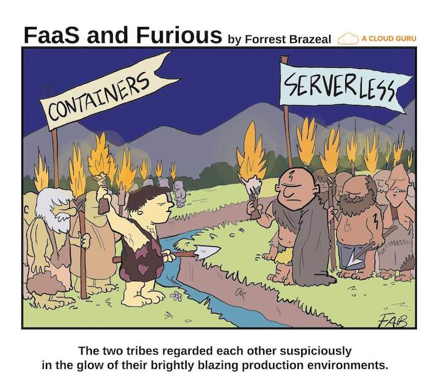

@title[Splash]
## Deploying Laravel from dev to production

---
@title[Who and What]
### about me
```php
$speaker = new Nerd();
$speaker->fullName = 'Riccardo Scasseddu';
$speaker->twitterHandle = '@ennetech';
$speaker->education = 'Graduated in Computer Science';
$speaker->occupation = 'Technical lead @ designbrothers';
$speaker->roles = ['Full Stack Developer', 'DevOps'];
$speaker->wannaBe = 'System architect';
$speaker->talkSpeed = 1.2;
$speaker->save();
```

### focus
<p class="fragment text-left text-07">Give an overview of different 'infrastructures'</p>

---
@title[Requirements]
## Laravel Requirements
<p class="fragment text-left text-07">WEBSERVER: apache2 / nginx / caddy / (swoole / php-pm / roadrunner)</p>
<p class="fragment text-left text-07">DATABASE: MySQL / PostgreSQL / SQL Server / <span class="text-red">SQLite</span></p>
<p class="fragment text-left text-07">CACHE: memcached / redis / database / <span class="text-red">file</span></p>
<p class="fragment text-left text-07">SESSION: cookie / database / memcached / redis / <span class="text-red">file</span> / <span class="text-red">array</span></p>
<p class="fragment text-left text-07">STORAGE: s3 / sftp / <span class="text-red">local</span></p>
<p class="fragment text-left text-07">QUEUE: database / redis</p>
<p class="fragment text-left text-07">LOGGING: monolog-remote / slack / <span class="text-red">single (file)</span></p>

+++
### Never forget
<p class="fragment text-left text-07">file permission / ownership</p>
<p class="fragment text-left text-07">url rewriting</p>
<p class="fragment text-left text-07">discrete versions in composer.json</p>
<p class="fragment text-left text-07">configure the .env (specially the APP_ENV variable)</p>

+++
### in dev remember
<p class="fragment text-left text-07">use xdebug</p>
<p class="fragment text-left text-07">use the App::environment() helper to enable or disable specific features</p>

---
@title[Panoramic]


---
@title[Local]
## local / self-hosted / OnPremises
<p class="fragment text-left text-07">total control of the environment</p>
<p class="fragment text-left text-07">prone to errors if managed without a configuration management tool</p>
<p class="fragment text-left text-07">difficult to scale</p>
<p class="fragment text-left text-07">no failover</p>
<p class="fragment text-left text-07">slow setup time</p>
<p class="fragment text-left text-07">requires hardening</p>
<p class="fragment text-left text-07">very flexible</p>
<p class="fragment text-left text-07">total control of the underlying OS</p>

+++
### Tools
<p class="fragment text-left text-07">Homestead</p>
<p class="fragment text-left text-07">Valet</p>
<p class="fragment text-left text-07">php artisan serve</p>
<p class="fragment text-left text-07">Mailhog</p>

+++
### Example
<p class="fragment text-left text-07">install and configure the os</p>
<p class="fragment text-left text-07">configure webserver + php</p>
<p class="fragment text-left text-07">configure cron</p>
<p class="fragment text-left text-07">configure queue</p>
<p class="fragment text-left text-07">copy files</p>

---
@title[IaaS]
## iaas
<p class="fragment text-left text-07">all of the local features</p>
<p class="fragment text-left text-07">pay as you go</p>
<p class="fragment text-left text-07">deploy new resources in very short time</p>
---
@title[PaaS]
## paas
<p class="fragment text-left text-07">no control on the underlying OS</p>
<p class="fragment text-left text-07">every provider uses his own configurations</p>
<p class="fragment text-left text-07">very simple to start using git or a cli</p>
<p class="fragment text-left text-07">trusted proxies have to be configured</p>

+++
### Example
<p class="fragment text-left text-07">add configuration file to the repo</p>
<p class="fragment text-left text-07">use the provider cli to deploy</p>
---
@title[Common problems]
## Common problems
<p class="fragment text-left text-07">file permissions</p>
<p class="fragment text-left text-07">file ownership</p>
<p class="fragment text-left text-07">different configurations</p>
<p class="fragment text-left text-07">version missmatch on dependencies</p>
<p class="fragment text-left text-07">firewall rules</p>
<p class="fragment text-left text-07">env configuration</p>
---
@title[PaaS]

---
@title[Questions]
# Questions?

<p style="text-align: center !important;">https://joind.in/talk/53009</p>
---
