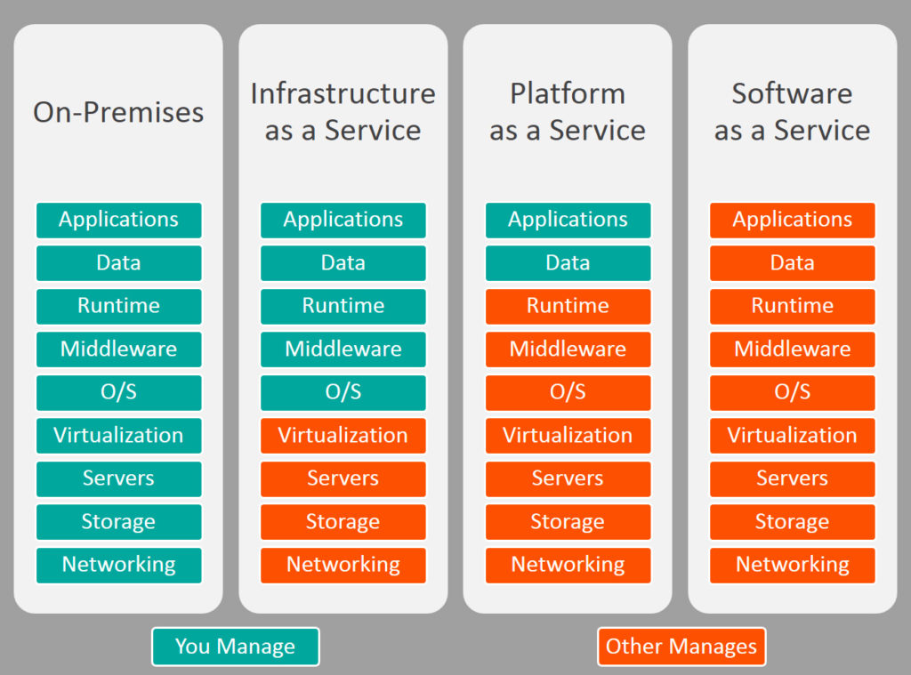

@title[Splash]
## Deploying Laravel from dev to production

---
@title[Who and What]
### about me
```php
$speaker = new Nerd();
$speaker->fullName = 'Riccardo Scasseddu';
$speaker->twitterHandle = '@ennetech';
$speaker->education = 'Graduated in Computer Science';
$speaker->occupation = 'Technical lead @ designbrothers';
$speaker->roles = ['Full Stack Developer', 'DevOps'];
$speaker->wannaBe = 'System architect';
$speaker->talkSpeed = 1.2;
$speaker->save();
```


---
@title[Requirements]
# Requirements
+++
## Webserver
### Classic
<p class="fragment text-left text-07">apache2</p>
<p class="fragment text-left text-07">nginx</p>
<p class="fragment text-left text-07">caddy</p>

### Asyncronous
<p class="fragment text-left text-07">swoole</p>
<p class="fragment text-left text-07">php-pm</p>

+++
### Never forget
<p class="fragment text-left text-07">file permission</p>
<p class="fragment text-left text-07">url rewriting</p>
<p class="fragment text-left text-07">configure the .env</p>

+++
## Database
<p class="fragment text-left text-07">MySQL</p>
<p class="fragment text-left text-07">PostgreSQL</p>
<p class="fragment text-left text-07">SQL Server</p>
<p class="fragment text-left text-07 text-red">SQLite</p>

+++
## Cache
<p class="fragment text-left text-07">memcached</p>
<p class="fragment text-left text-07">redis</p>
<p class="fragment text-left text-07">database</p>
<p class="fragment text-left text-07 text-red">file</p>

+++
## Session
<p class="fragment text-left text-07">cookie</p>
<p class="fragment text-left text-07">database</p>
<p class="fragment text-left text-07">memcached</p>
<p class="fragment text-left text-07">redis</p>
<p class="fragment text-left text-07 text-red">file</p>
<p class="fragment text-left text-07 text-red">array</p>

+++ 
## Storage
<p class="fragment text-left text-07">s3</p>
<p class="fragment text-left text-07">sftp</p>
<p class="fragment text-left text-07 text-red">local</p>
<p class="fragment text-left text-07">...</p>

+++ 
## Queue
<p class="fragment text-left text-07">database</p>
<p class="fragment text-left text-07">redis</p>
<p class="fragment text-left text-07">...</p>


---
@title[Panoramic]



---
@title[Local]
## local / self-hosted
+++
### Pro
<p class="fragment text-left text-07">total control of the envrioment</p>
<p class="fragment text-left text-07">dedicated performance</p>
<p class="fragment text-left text-07">php artisan serve</p>

### Cons
<p class="fragment text-left text-07">prone to errors</p>
<p class="fragment text-left text-07">difficult to scale</p>
<p class="fragment text-left text-07">no failover</p>

+++
### Tools
<p class="fragment text-left text-07">Homestead</p>
<p class="fragment text-left text-07">Valet</p>
<p class="fragment text-left text-07">php artisan serve</p>


---
@title[IaaS]
## iaas

```bash
PHP_VERSION=7.2
echo "deb http://ppa.launchpad.net/ondrej/php/ubuntu xenial main" > /etc/apt/sources.list.d/ondrej-php.list && \
echo "deb http://ppa.launchpad.net/ondrej/php-qa/ubuntu xenial main" > /etc/apt/sources.list.d/ondrej-php-qa.list && \
apt-key adv --keyserver keyserver.ubuntu.com --recv-keys 4F4EA0AAE5267A6C && \
apt-get update && apt-get -y --no-install-recommends install libgeos-dev \
  php$PHP_VERSION-fpm \
  php$PHP_VERSION-mysql \
  php$PHP_VERSION-curl \
  php$PHP_VERSION-gd \
  php$PHP_VERSION-mbstring \
  php$PHP_VERSION-imap \
  php$PHP_VERSION-zip \
  php$PHP_VERSION-xml

sed -i 's/^;cgi.fix_pathinfo=.*$/cgi.fix_pathinfo=0/' /etc/php/$PHP_VERSION/fpm/php.ini
sed -i 's/^memory_limit =.*$/memory_limit = 512M/' /etc/php/$PHP_VERSION/fpm/php.ini
sed -i 's/^upload_max_filesize =.*$/upload_max_filesize = 128M/' /etc/php/$PHP_VERSION/fpm/php.ini
sed -i 's/^post_max_size =.*$/post_max_size = 128M/' /etc/php/$PHP_VERSION/fpm/php.ini

sed -i 's/^;clear_env = no/clear_env = no/' /etc/php/$PHP_VERSION/fpm/pool.d/www.conf

curl -sS https://getcomposer.org/installer | php -- --install-dir=/usr/local/bin --filename=composer

```
---
@title[PaaS]
## paas
+++
### focus on developers
<p class="fragment text-left text-07">if you are fine with the default configuration</p>
<p class="fragment text-left text-07">if you don't need any particular extension</p>
<p class="fragment text-left text-07">the more is left behind, less is the control of it</p>
---
@title[PaaS]

---
@title[Questions]
# Questions?

<p style="text-align: center !important;">https://joind.in/talk/53009</p>
---
